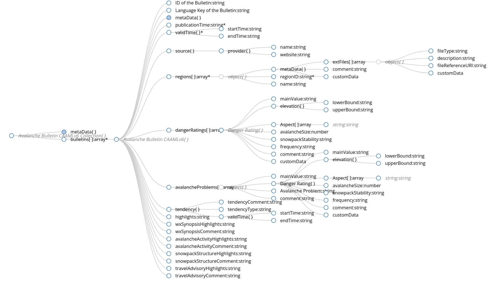

# CAAML V5.0

## Introduction 

The CAAML V5.0 Profile 'EAWS Bulletin' aims to facilitate the exchange of avalanche bulletin information among the European Avalanche Warning Services. This standard only contains the subset of CAAML elements needed for exchanging the information contained in the standard bulletins.

## Authors

This CAAML standard was developed by:

- Pascal Haegeli, Avisualanche Consulting (lead author)
- Johannes Hörtnagel, Tyrolean Avalanche Warning Service
- Patrick Nairz, Tyrolean Avalanche Warning Service
- Matthias Gerber, WSL Institute for Snow and Avalanche Research SLF

## Technical Documentation

http://caaml.org/Schemas/V5.0/Profiles/BulletinEAWS/Doc/

# CAAML V6.0 (draft)

