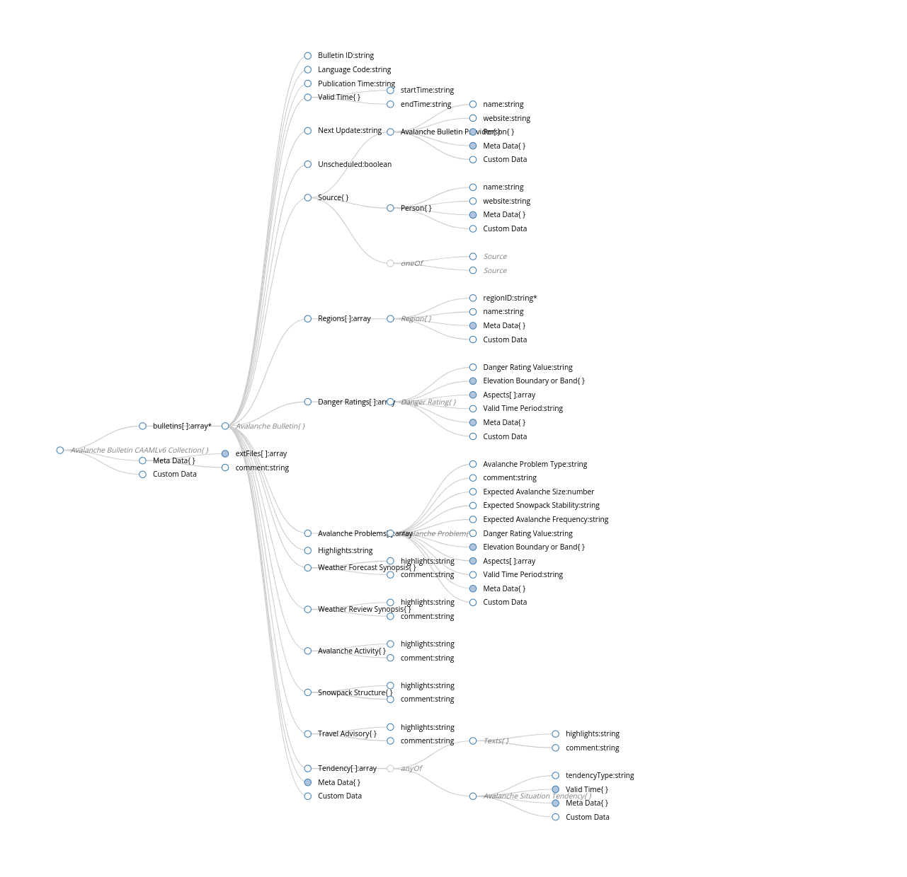

# CAAML - Bulletin EAWS

## Introduction 

The CAAML Profile 'EAWS Bulletin' aims to facilitate the exchange of avalanche bulletin information among the European Avalanche Warning Services.

## Authors

This CAAML standard was developed by:

- Pascal Haegeli, Avisualanche Consulting (lead author)
- Johannes Hörtnagel, Tyrolean Avalanche Warning Service
- Patrick Nairz, Tyrolean Avalanche Warning Service
- Matthias Gerber, WSL Institute for Snow and Avalanche Research SLF
- Norbert Lanzanasto, Tyrolean Avalanche Warning Service
- Jürg Trachsel, WSL Institute for Snow and Avalanche Research SLF
- Jonas Knerr, WSL Institute for Snow and Avalanche Research SLF
- Simon Legner, Technisches Büro Buchauer Markus
- Friedrich Mütschele, Tyrolean Avalanche Warning Service
